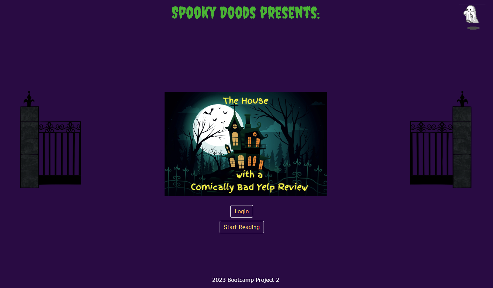
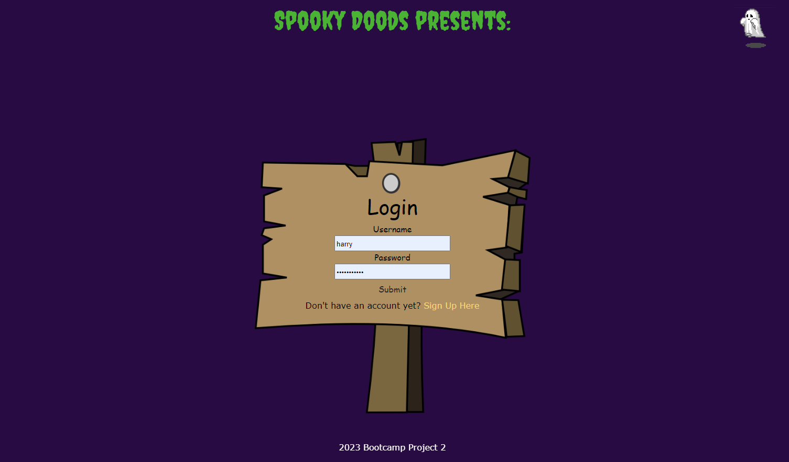
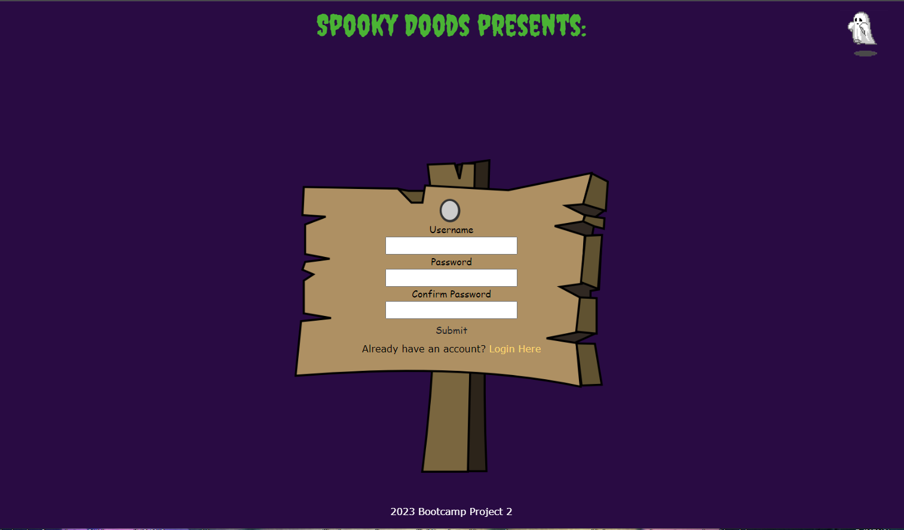

# THE HOUSE WITH THE COMICALLY BAD YELP REVIEW

This site is for users who enjoy nostalgic horror stories with a modern twist. "The House with the Comically Bad Yelp Review" creates an immersive experience where users can put their intuition to the test and see if they would survive a night in a haunted house. Features include animation, a login/signup page, a comments section, and a spooky animated ghost "home button".

- [Usage](#usage)
- [Development](#development)
- [Sessions](#sessions)
- [Authentication](#authentication)
- [Templates](#templates)
- [Code Style](#code-style)
- [Deploy to Heroku](#deploy-to-heroku)

## Usage

The homepage of this site should appear as so:

Selectin the login button will route users to the login page. If they don't have any login information saved, they have the option to click the signup link.

The signup page will appear as so:

Once users are logged in, they will be able to read the story. When the story is over, they have the option to leave a comment in the comments page.

## Development

[click this link to view this project's proposal](https://docs.google.com/document/d/1ewPnESOPCw304MIXz6Bu2y17ucfuHVgr6pkjIWyUSzs/edit#heading=h.kpv7qq2z2hft)

## Authentication

Passwords are hashed using [bcrypt](https://www.npmjs.com/package/bcrypt). Middleware for protected routes redirects to `/login`. This can be modified by updating [util/withAuth.js](./util/withAuth.js).

## Templates

[Handlebars.js](https://handlebarsjs.com/) and [express-handlebars](https://www.npmjs.com/package/express-handlebars) are used for rendering templates.

You can add your own custom helper functions by exporting them from [util/helpers.js](./util/helpers.js).

## Code Style

[ESLint](https://eslint.org/) and [Prettier](https://prettier.io/) are included for enforcing consistent code quality and format. The default configuration includes the ESLint recommended plugin, the Prettier plugin, plus a couple of additional rules. Modify [.eslintrc.js](./.eslintrc.json) to customize the rules.

## Deploy to Heroku

### Prerequisites

Sign up for an [Heroku](https://id.heroku.com/login) account and install the [Heroku CLI](https://devcenter.heroku.com/articles/heroku-cli).

The app must be setup using Git for version control in order to deploy on Heroku
following this guide. Be sure to initialize Git before proceeding if you did not
initially create this project by using the template repo.

### Create and Configure a Heroku App

The code for this boilerplate is pre-configured to deploy to Heroku and connect to the JAWS DB add-on for MySQL. In order to deploy, you must provision the JAWS DB add-on.

**IMPORTANT:** Payment info. must be provided in order to use the JawsDB MySQL
add-on. You must provide a credit card to use the service. **With the exception that all of you must be using the student package**

1. Create a Heroku app in the command line. `heroku create <optionally-provide an app name>`

2. Provision the [JawsDB MySQL add-on](https://elements.heroku.com/addons/jawsdb) with the free pricing plan. `heroku addons:create jawsdb:kitefin`

3. Add environmental variables to the heroku config. The boilerplate uses
   `SECRET` to sign the session id cookie. Use a tool to generate a long
   randomized string for this value. (e.g. `hsKVlvYcC5b#Fw1FS*qz`) Add `SECRET`
   to config by running `heroku config:set SECRET=<your long random secret>`.

4. Use the same command to add any other environmental variables required for
   your app to function. (`heroku config:set <name>=<value>`)

5. Deploy the app by running `git push heroku main`. (Use the command again to deploy updates.)

6. Open your app in the browser with `heroku open`.

### Seed JawsDB

Running `heroku run npm run seed` will run the seed script in Heroku if your
seeds are required for production.
